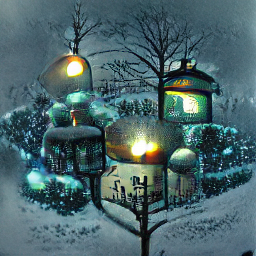

Feed forward VQGAN-CLIP model, where the goal is to eliminate the need for optimizing the latent
space of VQGAN for each input prompt. This  is done by training a model that takes as input
a text prompt, and returns as an output the VQGAN latent space, which is then
transformed into an RGB image. The model is trained on a dataset of text prompts
and can be used on unseen text prompts.
The loss function is minimizing the distance between the CLIP generated image 
features and the CLIP input text features. Additionally, a diversity loss can be used to make increase 
the diversity of the generated images given the same prompt.

[![Open In Colab][colab-badge]][colab-notebook]

[colab-notebook]: <https://colab.research.google.com/drive/1N8vvdhkvLaMefTIW_WYuJa-FflqyBnHr?usp=sharing>
[colab-badge]: <https://colab.research.google.com/assets/colab-badge.svg>

[Run it on Replicate](https://replicate.ai/mehdidc/feed_forward_vqgan_clip)

# News

- **09-22-2021** 
    - New models released (see 0.2 version in https://github.com/mehdidc/feed_forward_vqgan_clip#pre-trained-models)
    - New [Colab notebook](https://colab.research.google.com/drive/1QYg1J4i5gurhofkvwMNrlMibMOjnjU5I?usp=sharing) for training from scratch or fine-tuning
    - [Web interface](https://replicate.ai/mehdidc/feed_forward_vqgan_clip) to use the models using [Replicate AI](https://replicate.ai/home) 

# How to install?

### Download the 16384 Dimension Imagenet VQGAN (f=16)

Links:
- https://github.com/mehdidc/feed_forward_vqgan_clip/releases/download/0.1/vqgan_imagenet_f16_16384.ckpt (vqgan_imagenet_f16_16384.ckpt)
- https://github.com/mehdidc/feed_forward_vqgan_clip/releases/download/0.1/vqgan_imagenet_f16_16384.yaml  (vqgan_imagenet_f16_16384.yaml)
### Install dependencies. 

#### conda
```bash
conda create -n ff_vqgan_clip_env python=3.8
conda activate ff_vqgan_clip_env
# Install pytorch/torchvision - See https://pytorch.org/get-started/locally/ for more info.
(ff_vqgan_clip_env) conda install pytorch torchvision torchaudio cudatoolkit=11.1 -c pytorch -c nvidia
(ff_vqgan_clip_env) pip install -r requirements.txt
```
#### pip/venv
```bash
conda deactivate # Make sure to use your global python3
python3 -m pip install venv
python3 -m venv ./ff_vqgan_clip_venv
source ./ff_vqgan_clip_venv/bin/activate
$ (ff_vqgan_clip_venv) python -m pip install -r requirements.txt
```

# How to use?


## (Optional) Pre-tokenize Text
```
$ (ff_vqgan_clip_venv) python main.py tokenize data/list_of_captions.txt cembeds 128
```

## Train

Modify `configs/example.yaml` as needed.  

```
$ (ff_vqgan_clip_venv) python main.py train configs/example.yaml
```

## Tensorboard:
Loss will be output for tensorboard.
```bash
# in a new terminal/session
(ff_vqgan_clip_venv) pip install tensorboard
(ff_vqgan_clip_venv) tensorboard --logdir results
```


## Pre-trained models

### version 0.2 (last)

| Name           | Type   | Size    | Dataset                 | Link                                                                                            | Author   |
|----------------|--------|---------|-------------------------|-------------------------------------------------------------------------------------------------|----------|
| cc12m_8x128    | MLPMixer | 12.1MB  | Conceptual captions 12M | [Download](https://github.com/mehdidc/feed_forward_vqgan_clip/releases/download/0.2/cc12m_8x128_mlp_mixer.th)  | @mehdidc |
| cc12m_32x1024  | MLPMixer | 1.19GB  | Conceptual captions 12M | [Download](https://github.com/mehdidc/feed_forward_vqgan_clip/releases/download/0.2/cc12m_32x1024_mlp_mixer.th) | @mehdidc |
| cc12m_32x1024  | VitGAN | 1.55GB  | Conceptual captions 12M | [Download](https://github.com/mehdidc/feed_forward_vqgan_clip/releases/download/0.2/cc12m_32x1024_vitgan.th) | @mehdidc |

After downloading a model or finishing training your own model, you can test it with new prompts, e.g.,

- `wget https://github.com/mehdidc/feed_forward_vqgan_clip/releases/download/0.2/cc12m_32x1024_vitgan.th`
- `python -u main.py test cc12m_32x1024_vitgan.th "Picture of a futuristic snowy city during the night, the tree is lit with a lantern"`



### version 0.1

| Name           | Type   | Size    | Dataset                 | Link                                                                                            | Author   |
|----------------|--------|---------|-------------------------|-------------------------------------------------------------------------------------------------|----------|
| cc12m_8x128    | VitGAN | 12.1MB  | Conceptual captions 12M | [Download](https://github.com/mehdidc/feed_forward_vqgan_clip/releases/download/0.1/cc12m_8x128.th)  | @mehdidc |
| cc12m_16x256   | VitGAN | 60.1MB  | Conceptual captions 12M | [Download](https://github.com/mehdidc/feed_forward_vqgan_clip/releases/download/0.1/cc12m_16x256.th)  | @mehdidc |
| cc12m_32x512   | VitGAN | 408.4MB | Conceptual captions 12M | [Download](https://github.com/mehdidc/feed_forward_vqgan_clip/releases/download/0.1/cc12m_32x512.th)  | @mehdidc |
| cc12m_32x1024  | VitGAN | 1.55GB  | Conceptual captions 12M | [Download](https://github.com/mehdidc/feed_forward_vqgan_clip/releases/download/0.1/cc12m_32x1024.th) | @mehdidc |
| cc12m_64x1024  | VitGAN | 3.05GB  | Conceptual captions 12M | [Download](https://drive.google.com/file/d/15MdeW9fxYFEAlHRGqF3-Y7jY0lBrowP6/view?usp=sharing) | @mehdidc |
| bcaptmod_8x128 | VitGAN | 11.2MB  | Modified blog captions  | [Download](https://github.com/mehdidc/feed_forward_vqgan_clip/files/6878366/model.th.zip)       | @afiaka87|
| bcapt_16x128    | MLPMixer | 168.8MB  | Blog captions  | [Download](https://github.com/mehdidc/feed_forward_vqgan_clip/releases/download/0.1/bcapt_16x128.th)       | @mehdidc|

NB: cc12m_AxB means a model trained on conceptual captions 12M, with depth A and hidden state dimension B


You can also try it in the [Colab Notebook](https://colab.research.google.com/drive/1N8vvdhkvLaMefTIW_WYuJa-FflqyBnHr?usp=sharing).
Using the notebook you can generate images from pre-trained models and do interpolations between text prompts to create videos, see for instance [video 1](https://www.youtube.com/watch?v=8_EHeW5YIpk) or [video 2](https://www.youtube.com/watch?v=sl3gCli2R7g) or [video 3](https://www.youtube.com/watch?v=8dSiv96_2Vc)

# Acknowledgements

- The training code is heavily based on the VQGAN-CLIP notebook <https://colab.research.google.com/drive/1ZAus_gn2RhTZWzOWUpPERNC0Q8OhZRTZ>, thanks
to all the authors who contributed to the notebook ([@crowsonkb](https://github.com/crowsonkb), [@advadnoun](https://twitter.com/advadnoun), [@Eleiber](https://github.com/Eleiber), [@Crimeacs](https://twitter.com/earthml1), @Abulafia)
- Thanks to [@lucidrains](https://github.com/lucidrains), the MLP mixer model (`mlp_mixer_pytorch.py`)  is from <https://github.com/lucidrains/mlp-mixer-pytorch>.
- Thanks to Taming Transformers authors <https://github.com/CompVis/taming-transformers>, the code uses VQGAN pre-trained model and
VGG16 feature space perceptual loss <https://github.com/CompVis/taming-transformers/blob/master/taming/modules/losses/lpips.py>
- Thanks to [@afiaka87](https://github.com/afiaka87) for all the contributions to the repository's code and for providing the blog captions dataset for experimentation
- Thanks to VitGAN authors, the VitGAN model is from <https://github.com/wilile26811249/ViTGAN>
- Thanks to [@CJWBW](https://github.com/CJWBW) from [Replicate AI](https://replicate.ai/home) for making and hosting a browser based text to image interface using the model
